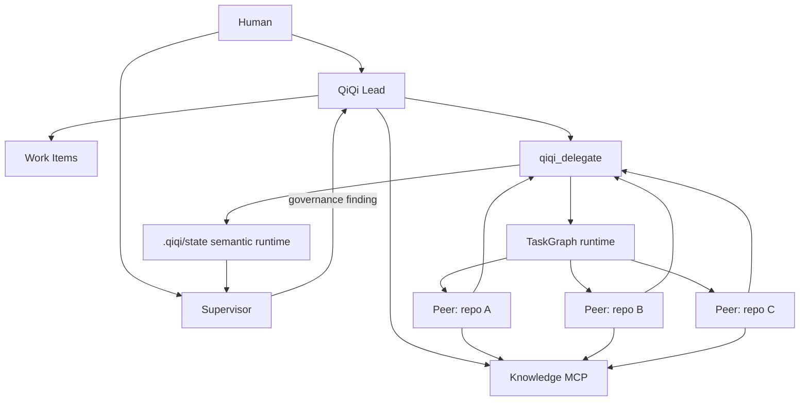

# Agent Knowledge Harness

`agent-knowledge-harness` là bộ template, policy và runtime cho workspace agent nhiều repository.

Repository này không chứa task thật của một workspace cụ thể. Nó cung cấp contract để Human, Supervisor, QiQi Lead và repository Peers phối hợp mà không trộn quyền sở hữu hoặc source of truth.

## Mục tiêu

Harness giải quyết bốn bài toán:

- điều phối thay đổi qua nhiều Git repository;
- giữ current task state bền vững giữa nhiều session;
- lưu reusable knowledge ngoài từng repository;
- giám sát communication loop và ownership mà không tạo technical Lead thứ hai.

Kiến trúc hiện tại dùng mô hình **Supervisor–Lead–Peers (SLP)**.



Supervisor quan sát governance. QiQi vẫn là technical Lead. Repository agents vẫn có independent technical judgment trong scope được giao.

## Thành phần

| Thành phần | Vai trò |
|---|---|
| `workspace-template/` | SLP control plane, QiQi Lead policy, Supervisor policy, `qiqi_delegate`, TaskGraph và workspace verification |
| `repo-template/` | Peer execution policy cho từng Git root |
| `work-item-template/` | Filesystem-native Work Item lifecycle và workspace-scoped `$work-item` skill |
| `knowledge-template/` | User-scoped Shared Knowledge MCP và `knowledge-distill` skill |
| `writing-template/` | User-scoped writing skills, hiện có `ste-vi` |
| `user-rules-template/` | User-scoped response và orchestration rules cho Codex và Claude Code |
| `migrations/` | Ordered migration definitions cho workspace/repository đã cài harness |
| `scripts/` | Migration entry point và migration tests |

## Authority boundary

SLP giữ authority rõ ràng.

| Role | Sở hữu |
|---|---|
| Human | product goal, priority, material cost, external effect, irreversible-risk decision |
| Supervisor | governance, intent/workflow deviation, communication-loop audit, bounded recovery |
| QiQi Lead | technical orchestration, dependency, TaskGraph, delegation, acceptance và Work Item reconciliation |
| Peer | một bounded repo-local outcome trong read/write scope được giao |

Supervisor không sửa implementation. Supervisor không `ACCEPT` hoặc `REJECT` candidate.

Peer không điều phối sibling Peer. Peer cũng không tự mở rộng scope sang sibling repository.

Mọi actionable delegation phải đóng đủ vòng:

```text
Lead brief
  -> actual Peer response
  -> explicit Lead disposition
```

`DONE`, passing tests hoặc runtime settled chỉ là evidence. Chúng không tự đồng nghĩa technical acceptance.

Shared contract nằm tại [`workspace-template/docs/WORKSPACE_PROTOCOL.md`](workspace-template/docs/WORKSPACE_PROTOCOL.md).

## Sources of truth

Mỗi loại state có một source of truth.

| State | Source of truth |
|---|---|
| current mutable product-task state | `<workspace>/work-items/` |
| reusable durable knowledge | Knowledge MCP |
| implementation behavior | repository source và tests |
| runtime/session/SLP semantic state | `<workspace>/.qiqi/state/` |

Work Item không phải execution history.

Herdr lifecycle events chỉ dùng để wake runtime. Chúng không tự chứng minh Peer result, acceptance hoặc Work Item state.

## Execution flow

Một tracked multi-repository task đi qua flow sau.

1. QiQi canonicalize request vào Work Item.
2. QiQi xác định dependency và repo ownership.
3. QiQi tạo self-sufficient TaskPacket cho từng repo-local assignment.
4. Với work có dependency, QiQi author TaskGraph.
5. `qiqi_delegate` chạy một conflict-free wave.
6. Peer tự điều tra, sửa code và verify trong Git root được giao.
7. Runtime capture actual native Peer response.
8. QiQi hydrate exact review evidence khi cần.
9. QiQi đưa explicit decision cho từng candidate.
10. QiQi reconcile Work Item và downstream inputs.
11. Verified reusable knowledge có thể được distill vào Knowledge MCP.

TaskPacket phải tự chứa `objective`, `scope` và `acceptance_criteria`. Mounted Work Item chỉ bổ sung durable continuity.

### TaskGraph outer loop

TaskGraph không tự suy luận topology từ child prose. QiQi author graph và quyết định semantic state.

```text
start_graph
    |
    v
delegate_next
    |
    +--> runnable wave
    |
    v
review_required
    |
    v
get_node_review / get_node_reviews
    |
    v
submit_decisions
    |
    +--> accept
    +--> retry
    +--> replan -> reconcile_graph
    +--> block
```

`delegate_next` có thể chạy nhiều repository độc lập trong cùng wave. Hiện runtime chỉ chạy tối đa một node cho mỗi repository trong một wave.

Chi tiết API nằm tại `workspace-template/mcp/qiqi_delegate/task_graph_mcp.py`.

## Autonomous Supervisor

Supervisor là independent governance plane. Nó không phải child agent của QiQi.

Persistent runtime dùng một Herdr control workspace với hai agent:

```text
slp-control
├── lead
└── supervisor
```

`qiqi_delegate` ghi semantic events vào SQLite runtime state. Supervisor Broker đọc durable semantic state và kiểm các governance rule.

Các rule chính phát hiện:

- Peer response chưa có explicit Lead disposition;
- downstream dependency bị dùng trước khi upstream được `ACCEPT`;
- active writable ownership bị overlap;
- `REOPEN_REQUEST`, `DEPENDENCY_REQUEST` hoặc `BLOCKED` chưa được resolve;
- stale candidate chưa được reconcile sau material Work Item revision.

Supervisor chỉ nhận bounded AuditPacket. Nó không nhận toàn bộ source tree hoặc transcript.

Chạy continuous broker từ workspace:

```bash
bash scripts/qiqi-supervisor-broker.sh
```

Chạy một full autonomous drain rồi thoát:

```bash
bash scripts/qiqi-supervisor-broker.sh --supervise-once
```

Chỉ chạy deterministic durable rules:

```bash
bash scripts/qiqi-supervisor-broker.sh --once
```

Nếu broker không chạy hoặc unhealthy, workspace không nên tuyên bố continuous supervision.

Runtime contract đầy đủ nằm tại [`workspace-template/docs/SUPERVISOR_RUNTIME.md`](workspace-template/docs/SUPERVISOR_RUNTIME.md).

## Work Item

Work Item là **current task dossier** ở cấp workspace.

Canonical location:

```text
<workspace>/work-items
```

Một dossier có thể chứa:

```text
work-items/<directory-key>/
├── 00_WORK_ITEM.md
├── 10_intake.md?
├── 20_investigation.md?
├── 30_plan.md?
├── 40_review.md?
├── references/?
└── 90_report.textile?
```

`00_WORK_ITEM.md` là current canonical task truth. Các lifecycle document là living state.

Requirement material thay đổi thì QiQi rewrite effective requirement và tăng `revision`. Prior findings được reconcile theo materiality.

Work Item không dùng global MCP hoặc SQLite service nữa.

Cài workspace-scoped skill:

```bash
cd work-item-template
bash scripts/work-item-template-check.sh
bash scripts/install-workspace-skill.sh /absolute/path/to/workspace
```

Skill được materialize vào:

```text
<workspace>/.agents/skills/work-item/
<workspace>/.claude/skills/work-item/
```

Repo child không nhận copy của `$work-item`. Child đọc TaskPacket và mounted Work Item, rồi trả evidence về QiQi.

Chi tiết nằm tại [`work-item-template/README.md`](work-item-template/README.md).

## Shared Knowledge

Shared Knowledge Store lưu reusable, non-trivial và evidence-backed knowledge.

Nó không thay thế live owner source/test.

Public MCP API:

```text
knowledge_search
knowledge_read
knowledge_read_metadata
knowledge_read_section
knowledge_write
knowledge_update
```

Luồng đọc ưu tiên progressive disclosure:

```text
knowledge_search
-> chọn exact target
-> đọc smallest sufficient semantic scope
-> mutate smallest safe semantic scope
```

Cài user-scoped Knowledge MCP:

```bash
bash knowledge-template/scripts/install-user-mcp.sh \
  --store-root /absolute/path/to/shared-knowledge/store
```

Mở fresh agent session sau khi cài.

Chi tiết schema, revision và partial update nằm tại [`knowledge-template/README.md`](knowledge-template/README.md).

## User rules và `ste-vi`

Cài writing skill và response rules cho cả Codex và Claude Code:

```bash
bash writing-template/scripts/install-user-skill.sh
bash user-rules-template/scripts/install-user-rules.sh
```

`ste-vi` áp dụng STE-lite cho tài liệu tiếng Việt. Skill ưu tiên câu ngắn, thuật ngữ ổn định và quan hệ nhân quả rõ.

Technical name, identifier, command, path, config key và error message được giữ nguyên.

Skill lấy cảm hứng từ ASD-STE100. Output tiếng Việt không được tuyên bố là ASD-STE100 compliant.

Nguồn skill: [`writing-template/skills/ste-vi/SKILL.md`](writing-template/skills/ste-vi/SKILL.md).

## Chuẩn bị workspace

### Workspace mới

Dùng [`workspace-template/docs/WORKSPACE_SETUP.md`](workspace-template/docs/WORKSPACE_SETUP.md) làm setup contract.

Mỗi repository phải dùng policy và checker từ `repo-template/`. Xem [`repo-template/docs/REPO_SETUP.md`](repo-template/docs/REPO_SETUP.md).

Trước delegation, cài Herdr integrations và sync `qiqi_delegate`:

```bash
herdr integration install codex
herdr integration install claude
herdr integration status

cd /path/to/workspace
uv sync --project mcp/qiqi_delegate
```

`repos.yaml` phải trỏ tới exact Git roots.

### Workspace đã cài harness

Migration engine áp ordered definitions trong `migrations/`.

Yêu cầu local:

```text
python3
git
yq
```

Kiểm tra trước khi ghi:

```bash
bash scripts/migrate-workspace.sh /absolute/path/to/workspace --dry-run
```

Apply migrations:

```bash
bash scripts/migrate-workspace.sh /absolute/path/to/workspace
```

Sau đó cài/update workspace-scoped `$work-item` skill và runtime prerequisites.

Cuối cùng chạy verification:

```bash
bash scripts/migrate-workspace.sh /absolute/path/to/workspace --verify
```

Migration state được lưu tại:

```text
<workspace>/.qiqi/agent-knowledge-harness-migrations.tsv
```

Không sửa historical migration để thay current contract. Public workspace/repo contract change phải có migration mới.

### Legacy Work Item SQLite

Nếu workspace còn legacy Work Item DB, export trước khi gỡ registration cũ:

```bash
cd work-item-template
python3 scripts/export-legacy-work-items.py \
  --workspace /absolute/path/to/workspace
```

Nếu legacy installer dùng custom DB path, truyền exact path:

```bash
python3 scripts/export-legacy-work-items.py \
  --workspace /absolute/path/to/workspace \
  --db /absolute/path/to/work-items.sqlite3
```

Sau khi kiểm tra imported dossiers:

```bash
bash scripts/remove-legacy-user-mcp.sh
```

Sau đó mới tiếp tục workspace migration.

## Verification

Chạy checker phù hợp với phần đã thay đổi.

Harness-level templates:

```bash
bash work-item-template/scripts/work-item-template-check.sh
bash knowledge-template/scripts/knowledge-template-check.sh
```

Materialized workspace:

```bash
cd /path/to/workspace
bash scripts/workspace-check.sh
```

Materialized repository:

```bash
cd /path/to/repository
bash scripts/repo-check.sh
```

Live continuous-supervision gate:

```bash
cd /path/to/workspace
bash scripts/e2e-autonomous-supervisor.sh <repository-name>
```

`workspace-check.sh` kiểm registry, dependency graph, exact Git roots, SLP artifacts, `qiqi_delegate` tests và Herdr readiness.

## Tài liệu nên đọc tiếp

| Mục tiêu | Tài liệu |
|---|---|
| Hiểu SLP authority và communication loop | [`workspace-template/docs/WORKSPACE_PROTOCOL.md`](workspace-template/docs/WORKSPACE_PROTOCOL.md) |
| Setup workspace | [`workspace-template/docs/WORKSPACE_SETUP.md`](workspace-template/docs/WORKSPACE_SETUP.md) |
| Hiểu persistent Supervisor runtime | [`workspace-template/docs/SUPERVISOR_RUNTIME.md`](workspace-template/docs/SUPERVISOR_RUNTIME.md) |
| Setup repository Peer | [`repo-template/docs/REPO_SETUP.md`](repo-template/docs/REPO_SETUP.md) |
| Hiểu Work Item lifecycle | [`work-item-template/README.md`](work-item-template/README.md) |
| Hiểu Shared Knowledge MCP | [`knowledge-template/README.md`](knowledge-template/README.md) |
| Hiểu user response rules | [`user-rules-template/README.md`](user-rules-template/README.md) |
| Hiểu `ste-vi` | [`writing-template/skills/ste-vi/SKILL.md`](writing-template/skills/ste-vi/SKILL.md) |

## Contributor contract

Repository này ship template, policy và runtime. Nó không chứa canonical state của một product task cụ thể.

Khi thay đổi contract:

- giữ role authority của SLP;
- giữ source-of-truth boundary;
- không phục hồi global Work Item MCP/SQLite;
- không biến Work Item thành turn history;
- không cho Peer sửa sibling repository hoặc canonical Work Item;
- chạy checker liên quan;
- thêm migration mới khi public workspace/repo contract thay đổi.

Contributor rules đầy đủ nằm tại [`AGENTS.md`](AGENTS.md).
